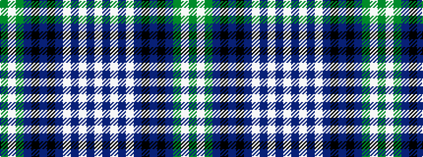

GWGBKBKBWBWBW

It is a 13 stripe tartan.

<figure class="pat-woven">

<figcaption>idealised sample</figcaption>
</figure>

## Colour Sequence



## Tartans with this colour sequence

| Tartans |
|---------------|
| [Oliphant Dress](/variants/s13/w25n2w2n2w2n10k2n4k2n10y23w2y4~x2/)|
||
| [Oliphant Dress (Clan)](/variants/s13/w25t2w2t2w2t10k2t4k2t10g23w2g4~x2/)|
||
