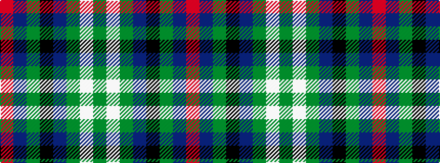

GWGBKGBR

It is a 8 stripe tartan.

<figure class="pat-woven">

<figcaption>idealised sample</figcaption>
</figure>

## Colour Sequence



## Tartans with this colour sequence

| Tartans |
|---------------|
| [MacFrog (Personal)](/variants/s8/r3db20g3k20db3g20w3g3~x2/)|
||
