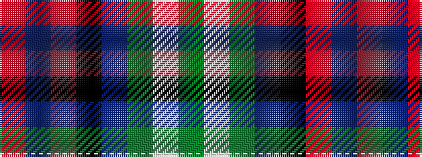

GWGBKRBR

It is a 8 stripe tartan.

<figure class="pat-woven">

<figcaption>idealised sample</figcaption>
</figure>

## Colour Sequence



## Tartans with this colour sequence

| Tartans |
|---------------|
| [Sawyer](/variants/s8/r2t1r8k4db1g10w1g2~x4/)|
||
