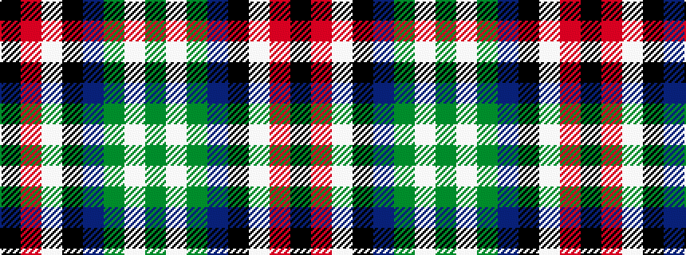

GWGBKWRK

It is a 8 stripe tartan.

<figure class="pat-woven">

<figcaption>idealised sample</figcaption>
</figure>

## Colour Sequence



## Tartans with this colour sequence

| Tartans |
|---------------|
| [Mull Rugby Club (Old)](/variants/s8/g44lb2g10t3k6lb1r2k18~x2/)|
||
