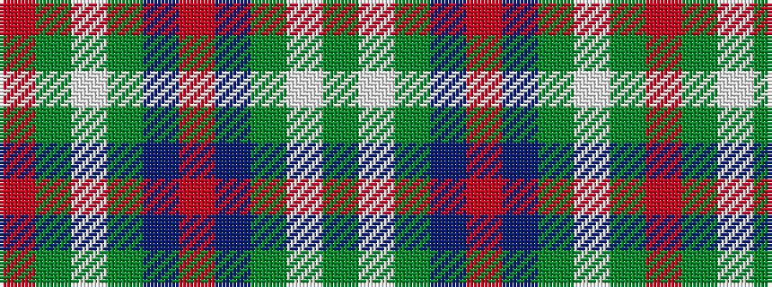

GWGBRBGWGR

It is a 10 stripe tartan.

<figure class="pat-woven">

<figcaption>idealised sample</figcaption>
</figure>

## Colour Sequence



## Tartans with this colour sequence

| Tartans |
|---------------|
| [Hardie](/setts/s10/dg9w2dg24dt37r3dt37dg24w2dg9m4~x2/)|
||
