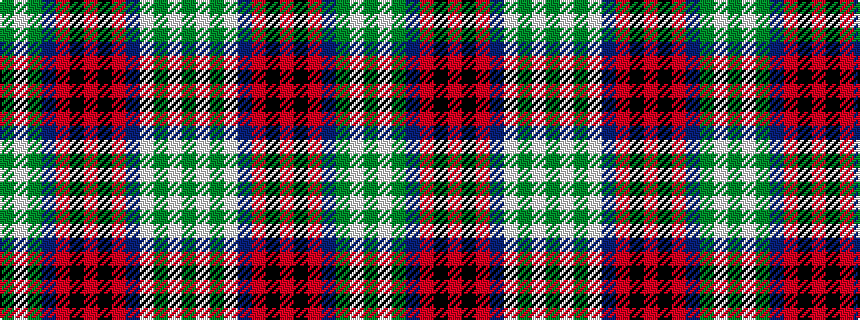

GWGBRKRKRBWGWG

It is a 14 stripe tartan.

<figure class="pat-woven">

<figcaption>idealised sample</figcaption>
</figure>

## Colour Sequence



## Tartans with this colour sequence

| Tartans |
|---------------|
| [Teirney (Estimated threadcount)](/variants/s14/g10w2g2w2b8r8k1r7k1r8b8g8w2g2~x2/)|
||
