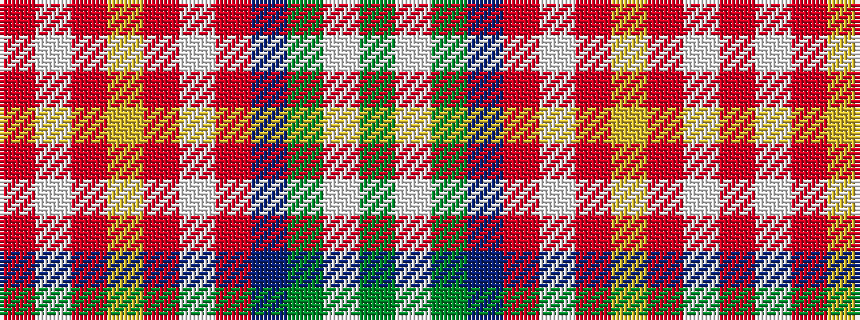

GWGBRWRYRWR

It is a 11 stripe tartan.

<figure class="pat-woven">

<figcaption>idealised sample</figcaption>
</figure>

## Colour Sequence



## Tartans with this colour sequence

| Tartans |
|---------------|
| [MacKellar, dress](/setts/s11/o35w4o3ly7o3w4o7dr15y4w36y5~x2/)|
||
