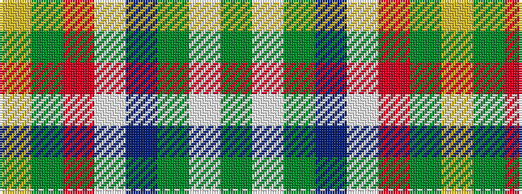

GWGBWRGY

It is a 8 stripe tartan.

<figure class="pat-woven">

<figcaption>idealised sample</figcaption>
</figure>

## Colour Sequence



## Tartans with this colour sequence

| Tartans |
|---------------|
| [Vermont Dress](/variants/s8/g1w1g6db5w6r1g1lo1~x4/)|
||
