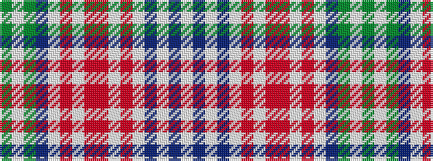

GWGBWRWRRWRWBWBW

It is a 16 stripe tartan.

<figure class="pat-woven">

<figcaption>idealised sample</figcaption>
</figure>

## Colour Sequence



## Tartans with this colour sequence

| Tartans |
|---------------|
| [Stuart-Houghton Dress (Personal)](/variants/s16/w11db4w4db2w4oi4w11o26oi4w3oi4w2db14dg10w16dg6~x2/)|
||
