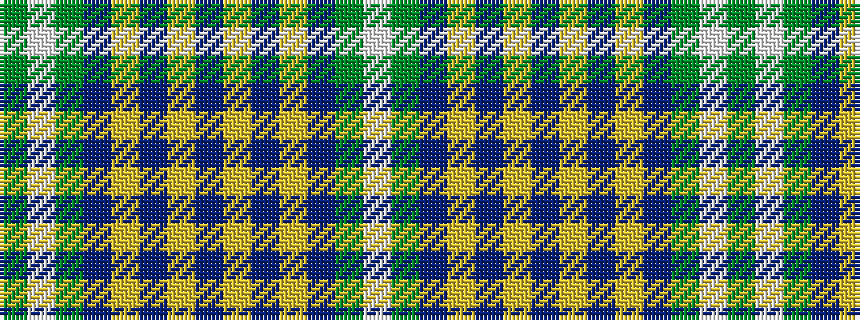

GWGBYBYBYBYBGW

It is a 14 stripe tartan.

<figure class="pat-woven">

<figcaption>idealised sample</figcaption>
</figure>

## Colour Sequence



## Tartans with this colour sequence

| Tartans |
|---------------|
| [MacAuliffe Name Tartan Tartan Number: 2839. Earliest known date: 2005 The MacAuliffes are Irish in origin, being a branch of the powerful MacCarthys. The MacAuliffe's are descended from Auliffe Alainn (Humphrey the Dandy) MacCarthy, the son of Donough MacCarthy, the son of Murcharch MacCarthy, the son of Teige MacCarthy, who was King of Desmond (south Munster) from 1118 to 1124. The tartan is available from House of Tartan, Scotland. See products available Copyright © Blair Urquhart, Comrie, 2015](/setts/s14/g37w2g6db23ly6db2ly3db2~x2/)|
|![MacAuliffe Name Tartan Tartan Number: 2839. Earliest known date: 2005 The MacAuliffes are Irish in origin, being a branch of the powerful MacCarthys. The MacAuliffe's are descended from Auliffe Alainn (Humphrey the Dandy) MacCarthy, the son of Donough MacCarthy, the son of Murcharch MacCarthy, the son of Teige MacCarthy, who was King of Desmond (south Munster) from 1118 to 1124. The tartan is available from House of Tartan, Scotland. See products available Copyright © Blair Urquhart, Comrie, 2015 example sett](/setts/s14/g37w2g6db23ly6db2ly3db2~x2/sett.png)|
