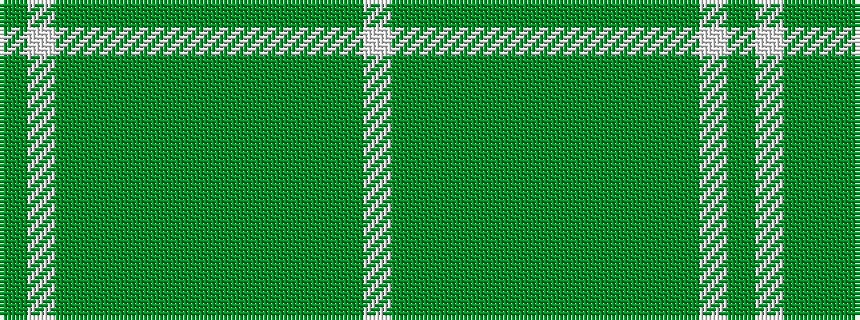

GWGGGGGGGGGGGW

It is a 14 stripe tartan.

<figure class="pat-woven">

<figcaption>idealised sample</figcaption>
</figure>

## Colour Sequence



## Tartans with this colour sequence

| Tartans |
|---------------|
| [Snaefell](/variants/s14/w16dy14y2dy2y2dy2y22dy2y2dy2y2dy14w16dy3~x2/)|
||
