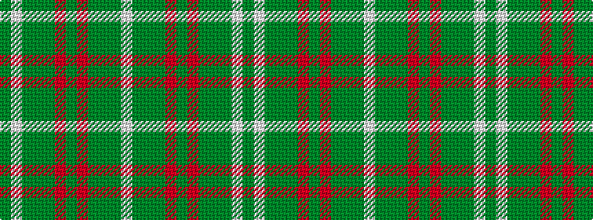

GWGGGRGRGGGW

It is a 12 stripe tartan.

<figure class="pat-woven">

<figcaption>idealised sample</figcaption>
</figure>

## Colour Sequence



## Tartans with this colour sequence

| Tartans |
|---------------|
| [Tricor](/variants/s12/y23o4dy6g6y4lb1y4~x4/)|
||
