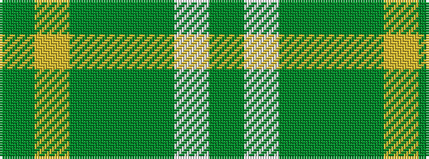

GWGGGYG

It is a 7 stripe tartan.

<figure class="pat-woven">

<figcaption>idealised sample</figcaption>
</figure>

## Colour Sequence



## Tartans with this colour sequence

| Tartans |
|---------------|
| [Freedom of Derry](/variants/s7/g14ly7g14dg50g64w6g7/)|
||
