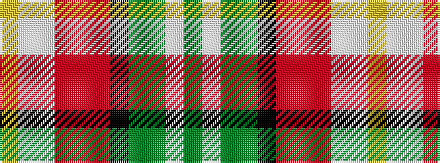

GWGGKRRRWWY

It is a 11 stripe tartan.

<figure class="pat-woven">

<figcaption>idealised sample</figcaption>
</figure>

## Colour Sequence



## Tartans with this colour sequence

| Tartans |
|---------------|
| [Jones, Alexander Michael (Personal)](/setts/s11/dg34w6y20y20k2r2r2r2lt24w40lo13/)|
||
