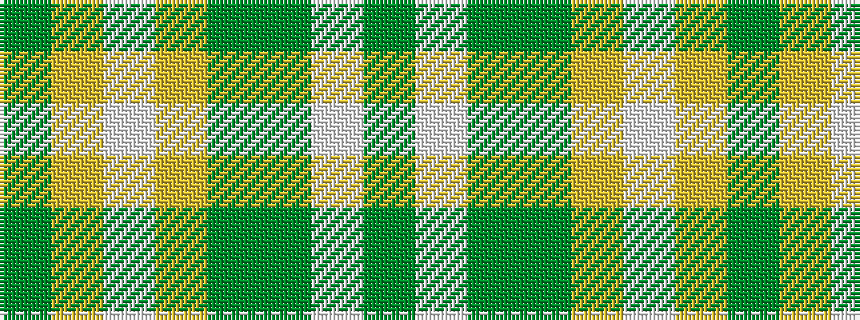

GWGGYWYG

It is a 8 stripe tartan.

<figure class="pat-woven">

<figcaption>idealised sample</figcaption>
</figure>

## Colour Sequence



## Tartans with this colour sequence

| Tartans |
|---------------|
| [Longniddry Green Error (Dance)](/setts/s8/g42ly1w2ly1g5dg12w32g4~x2/)|
||
