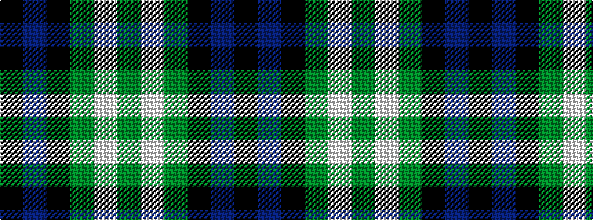

GWGKBK

It is a [6 stripe pattern](/stripes/stripes6/) — every 6-stripe pattern is gathered there.

<figure class="pat-woven">

<figcaption>idealised sample</figcaption>
</figure>

## Colour Sequence



## Tartans with this colour sequence

This pattern is a design lineage: every tartan below shares one colour order, whatever its owner —
near-identical designs are grouped, the largest lineage first (#112: the pattern is a tartan's
second parent, beside its family or clan).

<table class="sett-table">
<tbody>
<tr><td><a href="/tartans/c/co/coburg/">Coburg</a></td></tr>
<tr><td class="sett-swatch"></td></tr>
<tr><td><a href="/tartans/w/wi/wilson-s-no-150/">Wilson's No.150</a> <small class="dt">ΔTartan 0.16</small></td></tr>
<tr><td class="sett-swatch"></td></tr>
<tr><td><a href="/tartans/w/wi/wilson-s-no-158-2/">Wilson's No.158</a> <small class="dt">ΔTartan 0.44</small></td></tr>
<tr><td class="sett-swatch"></td></tr>
<tr><td><a href="/tartans/w/wi/wilson-s-no-158/">Wilson's No 158</a> <small class="dt">ΔTartan 0.50</small></td></tr>
<tr><td class="sett-swatch"></td></tr>
<tr><td><a href="/tartans/g/gr/graham-w/">Graham W</a> <small class="dt">ΔTartan 1.50</small></td></tr>
<tr><td class="sett-swatch"></td></tr>
<tr><td><a href="/tartans/r/re/redland/">Redland</a> <small class="dt">ΔTartan 1.66</small></td></tr>
<tr><td class="sett-swatch"></td></tr>
<tr><td><a href="/tartans/m/me/menteith/">Menteith</a> <small class="dt">ΔTartan 1.74</small></td></tr>
<tr><td class="sett-swatch"></td></tr>
<tr><td><a href="/tartans/g/gr/graham-of-menteith/">Graham of Menteith</a> <small class="dt">ΔTartan 2.02</small></td></tr>
<tr><td class="sett-swatch"></td></tr>
</tbody>
</table>

