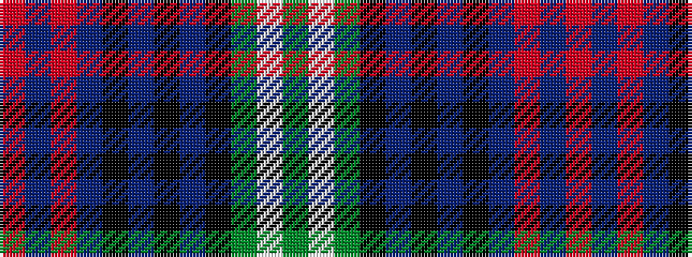

GWGKBKBKBRBR

It is a 12 stripe tartan.

<figure class="pat-woven">

<figcaption>idealised sample</figcaption>
</figure>

## Colour Sequence



## Tartans with this colour sequence

| Tartans |
|---------------|
| [Sutherland](/variants/s12/dg6lb2dg24k12db3k2db2k2db12r1db1r3/)|
||
| [Sutherland (Clan)](/variants/s12/g6w2g24k12db3k2db2k2db12r1db1r3~x2/)|
||
