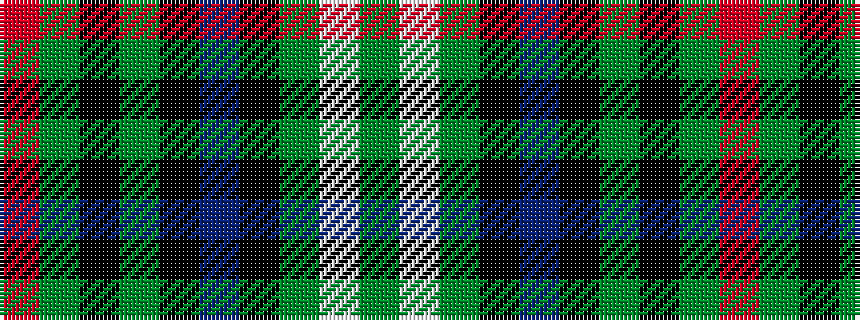

GWGKBKGKGR

It is a 10 stripe tartan.

<figure class="pat-woven">

<figcaption>idealised sample</figcaption>
</figure>

## Colour Sequence



## Tartans with this colour sequence

| Tartans |
|---------------|
| [Zorra Caledonian Society (Corporate](/setts/s10/dg3w2dg39k3t3k3dg3k20g10r2~x2/)|
||
