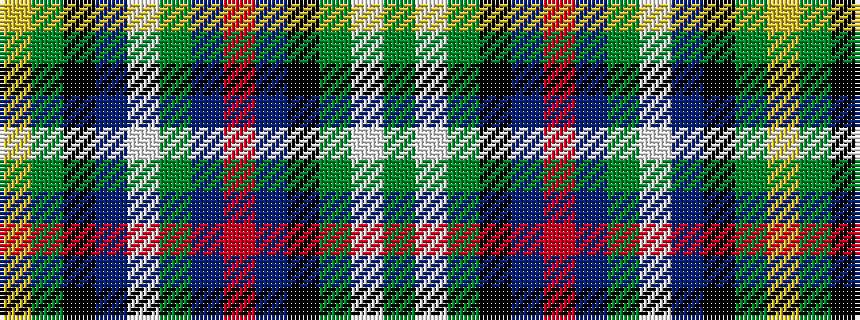

GWGKBRBGWBKGY

It is a 13 stripe tartan.

<figure class="pat-woven">

<figcaption>idealised sample</figcaption>
</figure>

## Colour Sequence



## Tartans with this colour sequence

| Tartans |
|---------------|
| [Greylock](/variants/s13/g10w2g10k3db12r3db12g15w2db3k2g3ly3~x2/)|
||
