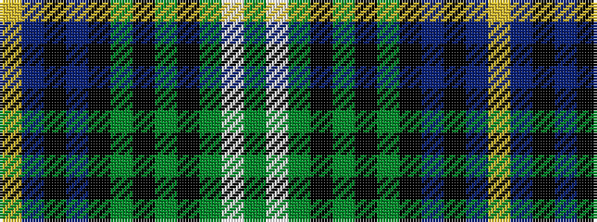

GWGKGKGKBKBY

It is a 12 stripe tartan.

<figure class="pat-woven">

<figcaption>idealised sample</figcaption>
</figure>

## Colour Sequence



## Tartans with this colour sequence

| Tartans |
|---------------|
| [Bell's Whisky (SA)](/setts/s12/dg10lb2dg18k3dg3k3dg3k18n24k3n3lo3~x2/)|
||
