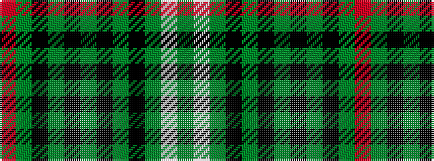

GWGKGKGKGKGR

It is a 12 stripe tartan.

<figure class="pat-woven">

<figcaption>idealised sample</figcaption>
</figure>

## Colour Sequence



## Tartans with this colour sequence

| Tartans |
|---------------|
| [Urquhart (White Line)](/variants/s12/g4w2g24k3g3k3g8k24gi48k3gi3r2~x2/)|
||
