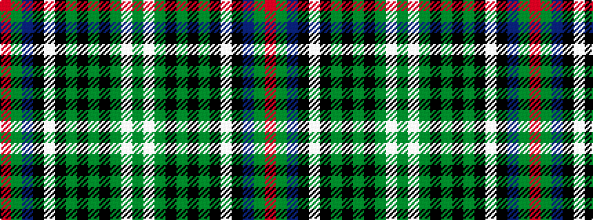

GWGKGKGKWKBGR

It is a 13 stripe tartan.

<figure class="pat-woven">

<figcaption>idealised sample</figcaption>
</figure>

## Colour Sequence



## Tartans with this colour sequence

| Tartans |
|---------------|
| [MacInnes Dress](/variants/s13/dg4w24dg3k3dg3k3dg24k4w4k4db24dg8r4~x2/)|
||
| [MacInnes, dress](/variants/s13/r4g8db24k4w4k4g24k3g3k3g3w24g4~x2/)|
||
