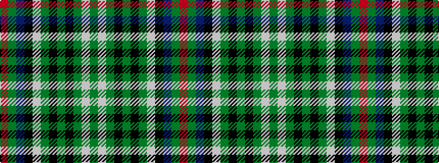

GWGKGKGWKBGR

It is a 12 stripe tartan.

<figure class="pat-woven">

<figcaption>idealised sample</figcaption>
</figure>

## Colour Sequence



## Tartans with this colour sequence

| Tartans |
|---------------|
| [MacInnes Dress (Dalgliesh)](/variants/s12/r4g16db24k4w4g24k3g3k3g3w24g4/)|
||
