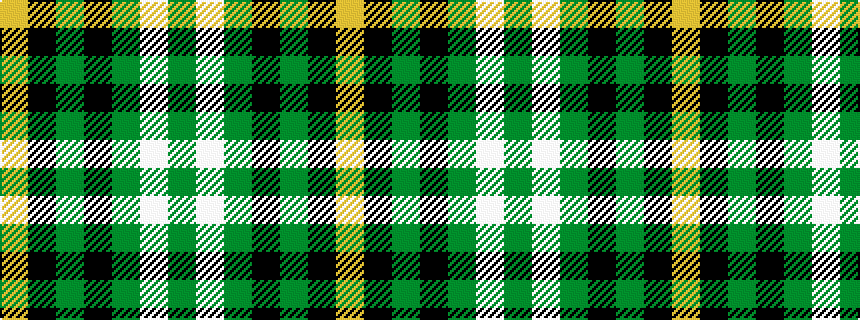

GWGKGKY

It is a 7 stripe tartan.

<figure class="pat-woven">

<figcaption>idealised sample</figcaption>
</figure>

## Colour Sequence



## Tartans with this colour sequence

| Tartans |
|---------------|
| [Instakilt, Green (Fashion)](/variants/s7/g8w4g50k12g4k15lo5~x2/)|
||
