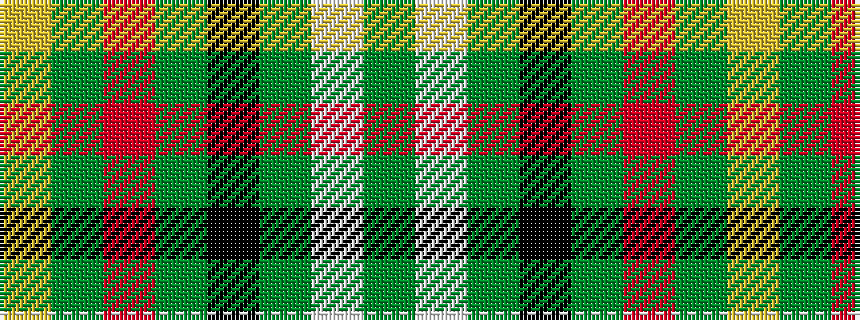

GWGKGRGY

It is a 8 stripe tartan.

<figure class="pat-woven">

<figcaption>idealised sample</figcaption>
</figure>

## Colour Sequence



## Tartans with this colour sequence

| Tartans |
|---------------|
| [Vermont](/setts/s8/g1w1g6k6g6r1g1ly1~x4/)|
||
