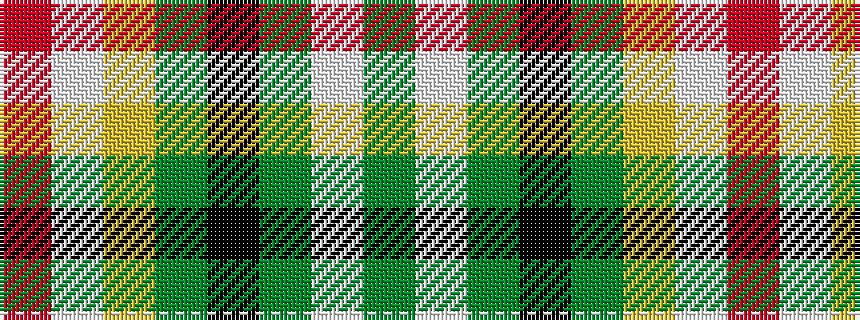

GWGKGYWR

It is a 8 stripe tartan.

<figure class="pat-woven">

<figcaption>idealised sample</figcaption>
</figure>

## Colour Sequence



## Tartans with this colour sequence

| Tartans |
|---------------|
| [McShane (Personal)](/setts/s8/g9lb2g9k2dy14ly4lb2r2~x4/)|
||
