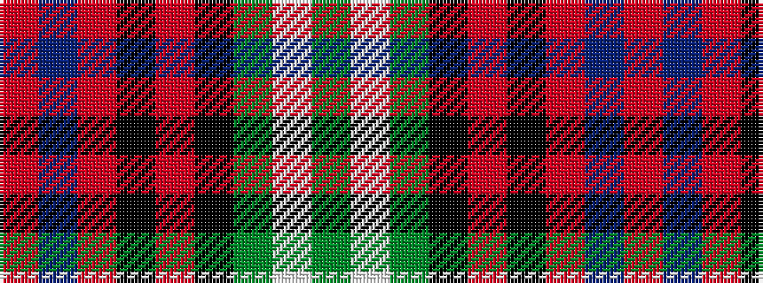

GWGKRKRBR

It is a 9 stripe tartan.

<figure class="pat-woven">

<figcaption>idealised sample</figcaption>
</figure>

## Colour Sequence



## Tartans with this colour sequence

| Tartans |
|---------------|
| [Glen Chalmadale](/setts/s9/g13w2g10k5r13k3r5dt15o5~x2/)|
||
