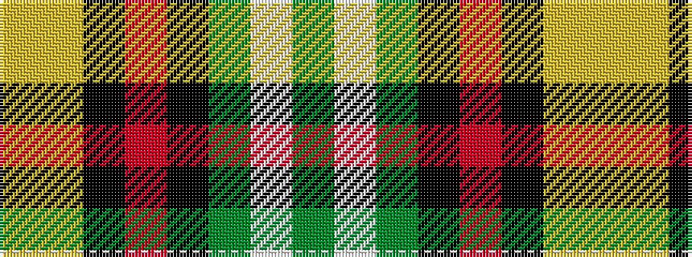

GWGKRKYY

It is a 8 stripe tartan.

<figure class="pat-woven">

<figcaption>idealised sample</figcaption>
</figure>

## Colour Sequence



## Tartans with this colour sequence

| Tartans |
|---------------|
| [Dunedin (NZ)](/setts/s8/g1w1g4k1r1k1lg4ly1~x8/)|
||
