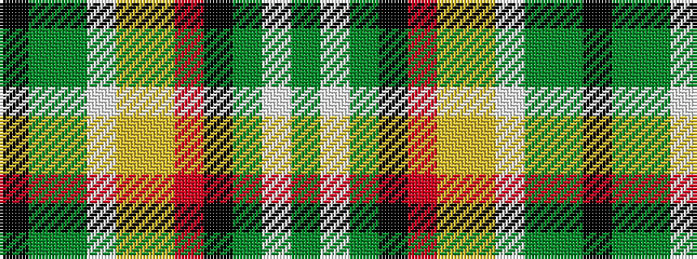

GWGKRYYWGGK

It is a 11 stripe tartan.

<figure class="pat-woven">

<figcaption>idealised sample</figcaption>
</figure>

## Colour Sequence



## Tartans with this colour sequence

| Tartans |
|---------------|
| [International Bear Pride](/variants/s11/k35dy11y3w1ly3lo1o5k5y2w2dy22~x2/)|
||
