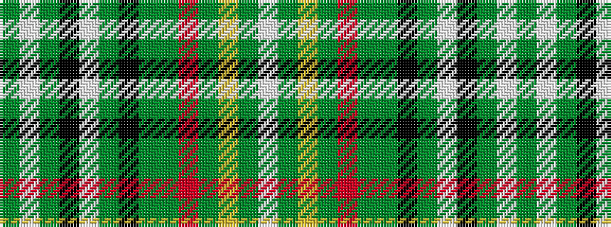

GWGKWGKGGRGYGW

It is a 14 stripe tartan.

<figure class="pat-woven">

<figcaption>idealised sample</figcaption>
</figure>

## Colour Sequence



## Tartans with this colour sequence

| Tartans |
|---------------|
| [Reilly fae the Mearns](/setts/s14/g2w5dg1k7w1dg2k6dg6g9o1g30ly2g3w2~x2/)|
||
| [Reilly fae the Mearns (Personal)](/setts/s14/g2w5dg1k7w1dg2k6dg6g9r1g30lo2g3w2~x2/)|
||
