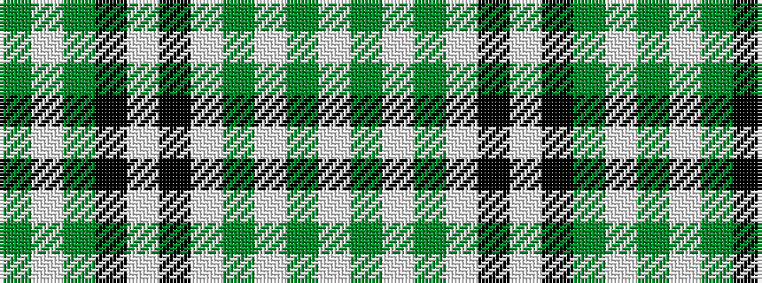

GWGKWKWGWGW

It is a 11 stripe tartan.

<figure class="pat-woven">

<figcaption>idealised sample</figcaption>
</figure>

## Colour Sequence



## Tartans with this colour sequence

| Tartans |
|---------------|
| [Clergy 6](/setts/s11/y1w1y6k6w1k6w1y1w1y3w1~x2/)|
||
