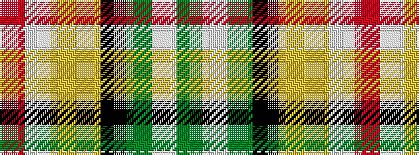

GWGKYYWR

It is a 8 stripe tartan.

<figure class="pat-woven">

<figcaption>idealised sample</figcaption>
</figure>

## Colour Sequence



## Tartans with this colour sequence

| Tartans |
|---------------|
| [MacShane (Clan)](/setts/s8/dg9w2dg9k2lo14lo4w2r2~x4/)|
||
