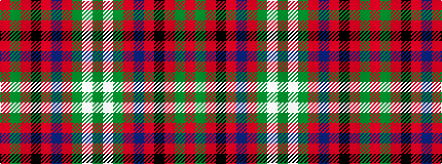

GWGRBRKRGR

It is a 10 stripe tartan.

<figure class="pat-woven">

<figcaption>idealised sample</figcaption>
</figure>

## Colour Sequence



## Tartans with this colour sequence

| Tartans |
|---------------|
| [Seton](/variants/s10/dg6lb1dg12r4db4r2k4r32dg1r2~x2/)|
||
| [Seton](/variants/s10/g6w1g12r4db4r2k4r32g1r2~x2/)|
||
| [Seton (Clan)](/variants/s10/g3w1g6r2dp2r1k2r10g1r2~x8/)|
||
