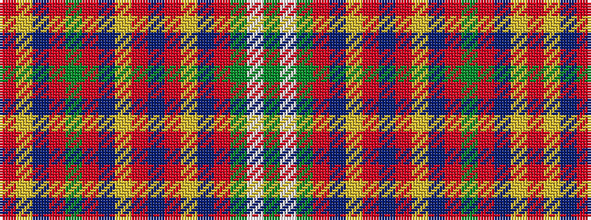

GWGRBYRBRYBRGRBYR

It is a 17 stripe tartan.

<figure class="pat-woven">

<figcaption>idealised sample</figcaption>
</figure>

## Colour Sequence



## Tartans with this colour sequence

| Tartans |
|---------------|
| [Stirling Weavers Guild](/variants/s17/r46ly2db2r5dg46r5db2ly2r5db10r5ly2db2r49dg5w5dg5~x2/)|
||
| [Stirling, Weavers Guild](/variants/s17/r46ly2db2r5g46r5db2ly2r5db10r5ly2db2r49g5w5g5~x2/)|
||
