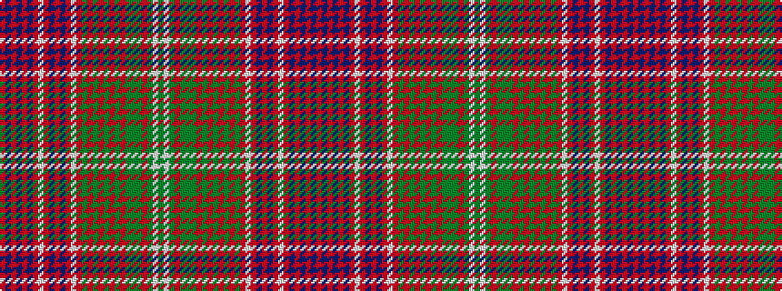

GWGRGGGRGRGRGRGRWRBRBRWRBRBRBR

It is a 30 stripe tartan.

<figure class="pat-woven">

<figcaption>idealised sample</figcaption>
</figure>

## Colour Sequence



## Tartans with this colour sequence

This pattern is a design lineage: every tartan below shares one colour order, whatever its owner —
near-identical designs are grouped, the largest lineage first (#112: the pattern is a tartan's
second parent, beside its family or clan).

<table class="sett-table">
<tbody>
<tr><td><a href="/variants/s30/r9db1r1db2r1db1r9w1r4db11r2db11r4w1r9g2r4g2r9g5r3g4r3g3y1g3r3g6w1g6~x2/">Lumsden (Short)</a></td></tr>
<tr><td class="sett-swatch"></td></tr>
</tbody>
</table>

