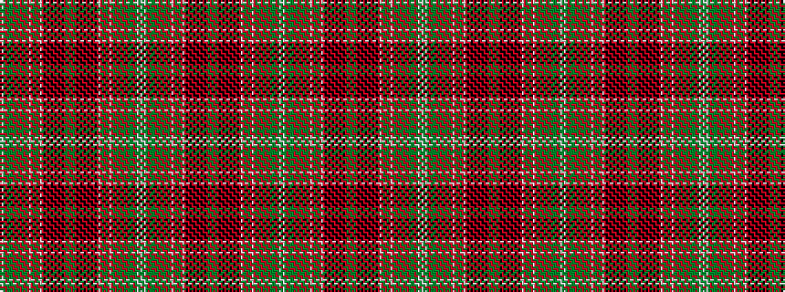

GWGRGGGRGRGRGRGRWRGRGRWRKRKRKRKRKRKRGRGRGRKRKRKRKRKRKRWRGRGRWRGRGRGRGRGGGRGWGW

It is a 78 stripe tartan.

<figure class="pat-woven">

<figcaption>idealised sample</figcaption>
</figure>

## Colour Sequence



## Tartans with this colour sequence

| Tartans |
|---------------|
| [Kinnoull](/variants/s78/dg16lb3dg9r12dg8y7dg8r12dg12r8dg12r26dg4r12dg4r26lb3r12yi33r7yi33r12lb3r26k2r2k5r2k2r26k2r2k5r2k2r26dg24r7dg24r7dg24r26k2r2k5r2k2r26k2r2k5r2k2r26lb3r12yi33r7yi33r12lb3r26dg4r12dg4r26dg12r8dg12r12dg8y7-h78fd84859a2305ce/)|
||
