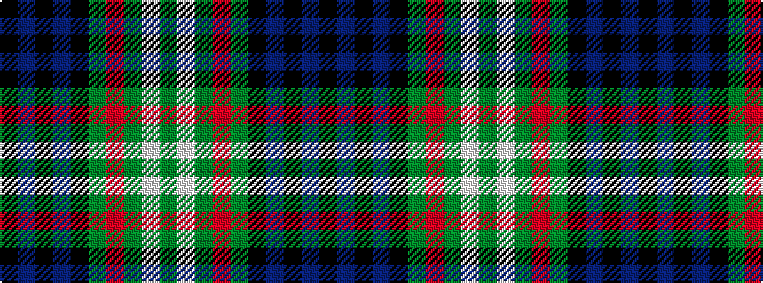

GWGRGKBKBK

It is a 10 stripe tartan.

<figure class="pat-woven">

<figcaption>idealised sample</figcaption>
</figure>

## Colour Sequence



## Tartans with this colour sequence

| Tartans |
|---------------|
| [Allon/Allan](/tartans/g8w1g1r1g4k4db8k1db1k1/)|
||
| [Scott #2](/setts/s10/dg8w1dg1r1dg4k4db8k1db1k1~x2/)|
||
