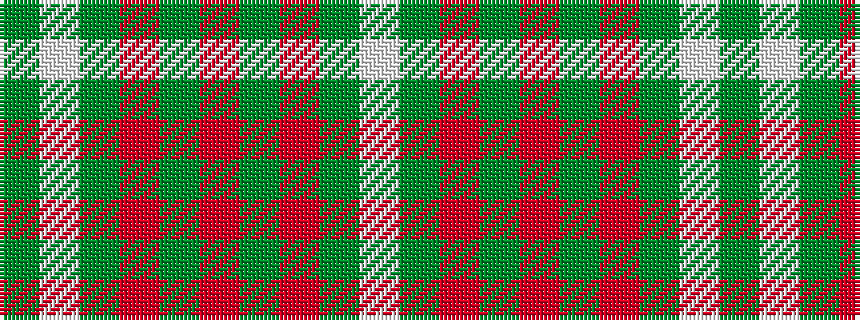

GWGRGRGRGW

It is a 10 stripe tartan.

<figure class="pat-woven">

<figcaption>idealised sample</figcaption>
</figure>

## Colour Sequence



## Tartans with this colour sequence

| Tartans |
|---------------|
| [Dundee, Green](/variants/s10/g3w2g3r1g6r3g3r1g2w3~x2/)|
||
