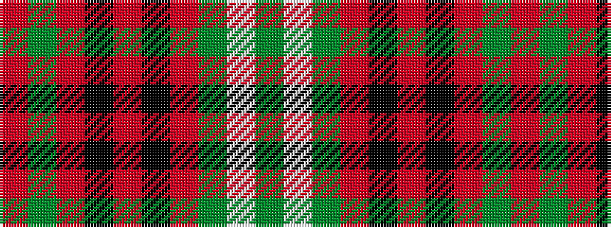

GWGRKRKRGR

It is a 10 stripe tartan.

<figure class="pat-woven">

<figcaption>idealised sample</figcaption>
</figure>

## Colour Sequence



## Tartans with this colour sequence

| Tartans |
|---------------|
| [Morrison Ancient](/setts/s10/dg6w3dg12r12k4r6k4r24dg4r6/)|
||
| [Morrison, Ancient](/setts/s10/r6g4r24k4r6k4r12g12w3g6/)|
||
