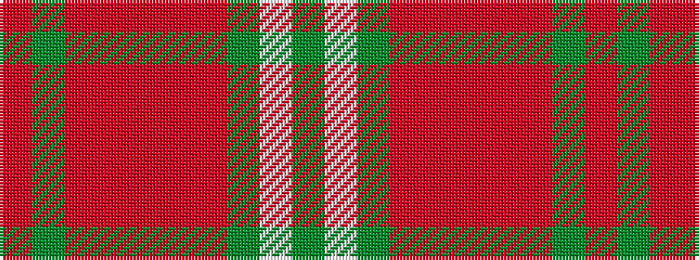

GWGRRRRRGR

It is a 10 stripe tartan.

<figure class="pat-woven">

<figcaption>idealised sample</figcaption>
</figure>

## Colour Sequence



## Tartans with this colour sequence

| Tartans |
|---------------|
| [Seton, hunting](/variants/s10/g6w1g12o4r4o2r4o32g1o2~x2/)|
||
