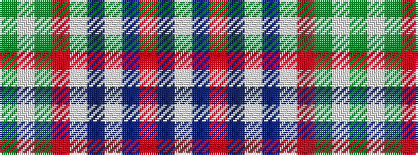

GWGRWBWBRBW

It is a 11 stripe tartan.

<figure class="pat-woven">

<figcaption>idealised sample</figcaption>
</figure>

## Colour Sequence



## Tartans with this colour sequence

| Tartans |
|---------------|
| [Schuster (Bavaria) (Personal), Benedikt](/setts/s11/g1w1g39r2w3n13w3do2r1do2w1~x2/)|
||
| [Schuster (Perosnal)](/setts/s11/g1w1g39r2w3b13w3dr2r1dr2w1~x2/)|
||
