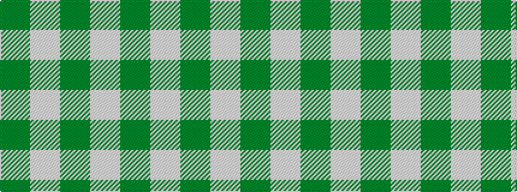

GWGW

It is a 4 stripe tartan.

<figure class="pat-woven">

<figcaption>idealised sample</figcaption>
</figure>

## Colour Sequence



## Tartans with this colour sequence

| Tartans |
|---------------|
| [Lewis, Green (Dance)](/variants/s4/dg4w35g31w4~x2/)|
||
| [Shepherd (Brown & White)](/variants/s4/dy1lb1~x6/)|
||
