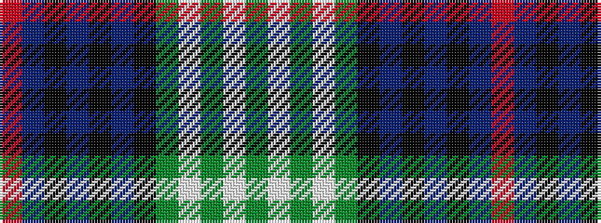

GWGWGKBKBKBR

It is a 12 stripe tartan.

<figure class="pat-woven">

<figcaption>idealised sample</figcaption>
</figure>

## Colour Sequence



## Tartans with this colour sequence

| Tartans |
|---------------|
| [Scotch House (Fashion)](/setts/s12/dg2lb1dg1lb1dg8k4db2k1db1k1db8o1~x4/)|
||
