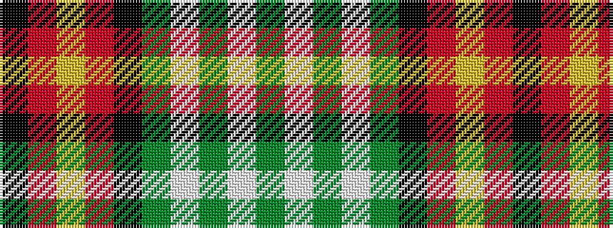

GWGWGKRYRK

It is a 10 stripe tartan.

<figure class="pat-woven">

<figcaption>idealised sample</figcaption>
</figure>

## Colour Sequence



## Tartans with this colour sequence

| Tartans |
|---------------|
| [Bomb Disposal](/variants/s10/k28r3ly2r3k13g28w1g3w1g16~x2/)|
||
