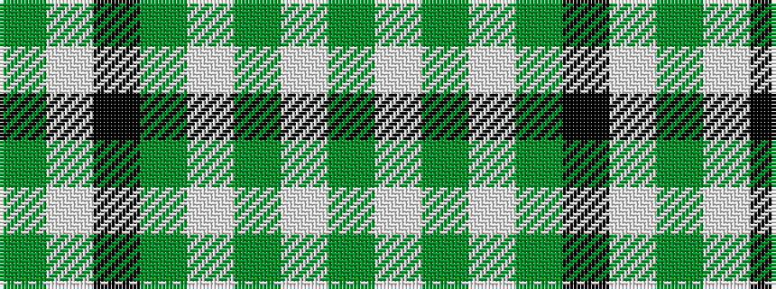

GWGWGKWG

It is a 8 stripe tartan.

<figure class="pat-woven">

<figcaption>idealised sample</figcaption>
</figure>

## Colour Sequence



## Tartans with this colour sequence

| Tartans |
|---------------|
| [Marshall University](/setts/s8/g25w1dg2w1g6k2w2dg3~x2/)|
||
