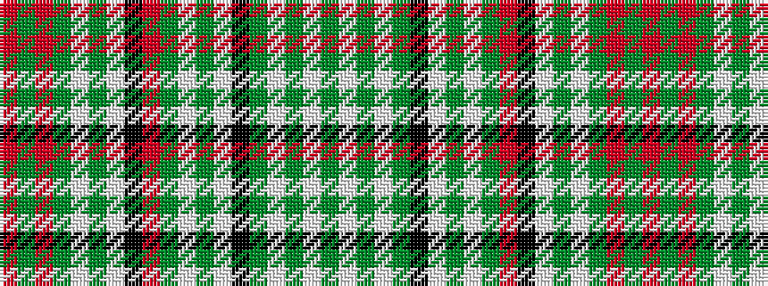

GWGWGKWGWGRKWGWGRGR

It is a 19 stripe tartan.

<figure class="pat-woven">

<figcaption>idealised sample</figcaption>
</figure>

## Colour Sequence



## Tartans with this colour sequence

| Tartans |
|---------------|
| [Shepherd, Derek (Modern)](/variants/s19/o2dg1o2dg1w1dg1w8k40o5dg40w10dg1w5k15dg1w7dg1w1dg1~x2/)|
||
