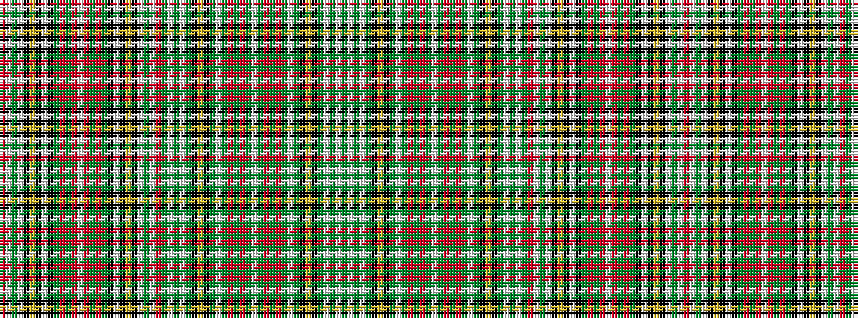

GWGWGKYKGWGRGRGWGRGRGWGKYKGWGWGRWGWKYKWKGRGRWRGRGKWKYKWGWR

It is a 58 stripe tartan.

<figure class="pat-woven">

<figcaption>idealised sample</figcaption>
</figure>

## Colour Sequence



## Tartans with this colour sequence

| Tartans |
|---------------|
| [Victoria, Highland dress](/setts/s58/r5w23g5w5k7ly3k3w2k3g16r8g3r6w3r6g3r8g16k3w2k3ly3k7w5g5w23r4g1w19g4w4g1k5ly3k2g1w4g15r6g3r5g1w3g1r5g3r6g15w4g1k2ly3k5g1w4g4w19g1~x2/)|
||
