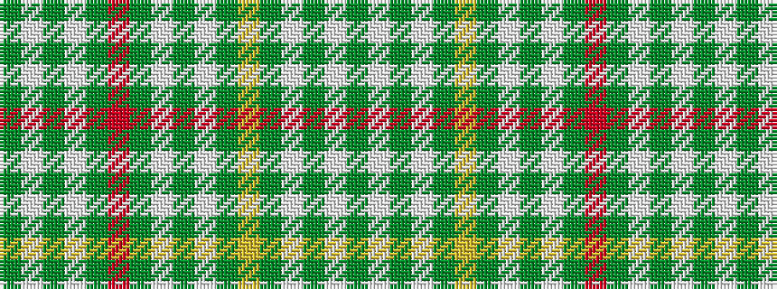

GWGWGRGWGWGYGWGWG

It is a 17 stripe tartan.

<figure class="pat-woven">

<figcaption>idealised sample</figcaption>
</figure>

## Colour Sequence



## Tartans with this colour sequence

| Tartans |
|---------------|
| [Jubilee (Artefact)](/setts/s17/g3lb24g8lb12g44r6g44lb48g6lb48g44lo6g44lb12g8lb24g3/)|
||
