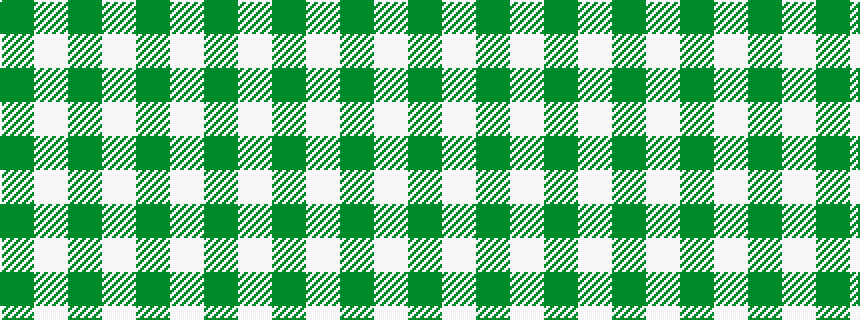

GWGWGW

It is a 6 stripe tartan.

<figure class="pat-woven">

<figcaption>idealised sample</figcaption>
</figure>

## Colour Sequence



## Tartans with this colour sequence

| Tartans |
|---------------|
| [Erskine Green](/variants/s6/dg6w2dg29w29dg2w6~x2/)|
||
| [Erskine, Green (Dance)](/variants/s6/g6w2g29w29g2w6~x2/)|
||
