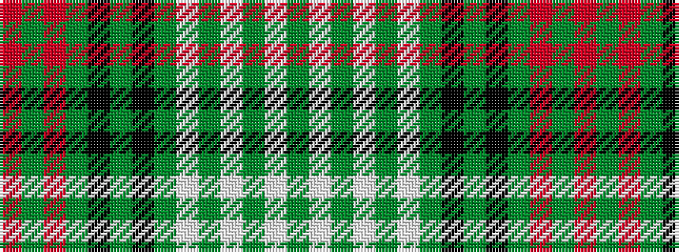

GWGWGWGKGKGRGR

It is a 14 stripe tartan.

<figure class="pat-woven">

<figcaption>idealised sample</figcaption>
</figure>

## Colour Sequence



## Tartans with this colour sequence

| Tartans |
|---------------|
| [Ross Hunting](/setts/s14/dg2w4dg2w1dg1w1dg3k2dg2k2dg12r1dg2r1~x2/)|
||
